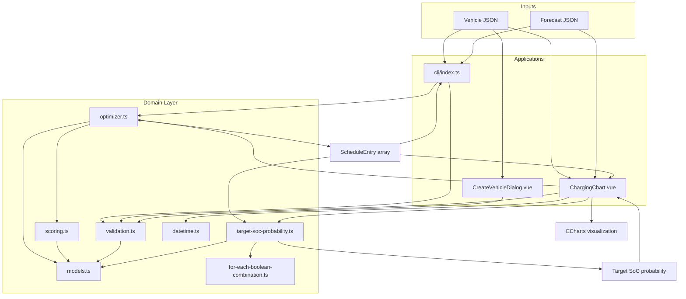
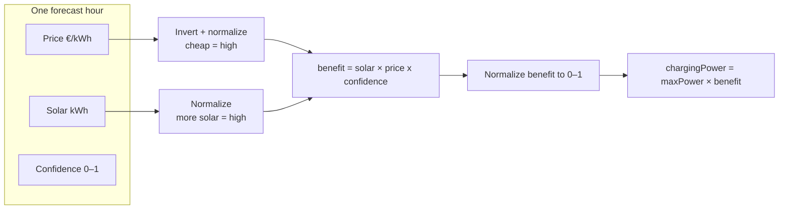

# EV Charging Schedule Optimizer

An algorithm and visualization tool that builds an EV charging schedule from hourly forecasts of electricity price, solar production, and plug-in confidence.

Goal: Reduce energy costs while maximizing local solar use, with uncertainty factored in.

## Approach

For each forecast hour in the planning window, the optimizer calculates a benefit score from 0 to 1 that indicates how favorable the hour is for charging. Charging energy is then distributed across the hours in proportion to these benefit scores.

1. **Solar** — more available solar raises the score.
2. **Price** — cheaper grid electricity raises the score.
3. **Confidence** — higher plug-in probability raises the score.

Charging power in each hour is then set proportionally:

```
chargingPower = maxChargingPower × benefit
```

If the sum of planned energy exceeds the remaining battery capacity, all hours are scaled down uniformly so the total fits.

**Target time** is a hard deadline: only forecast hours whose start is on or before the target are considered. Sub-hour targets are supported.

**Target SoC** is validated on input and shown in the UI as a reference line. The optimizer itself plans energy up to the remaining battery capacity (toward 100%), not strictly to `targetSoC`.

**Probability to reach target SoC** — after the schedule is built, we also calculate how likely it is that the vehicle will actually reach `targetSoC`. For each charging hour, the plug-in may succeed (delivering the planned energy) or fail (delivering nothing), according to that hour's confidence. We add up the probability of every outcome where enough energy is delivered.

## Project structure

```
src/
├── domain/
│   ├── models.ts                        # Vehicle, ForecastHour, ScheduleEntry types
│   ├── validation.ts                    # JSON parsing and input validation
│   ├── scoring.ts                       # Hour benefit scoring
│   ├── optimizer.ts                     # Schedule generation
│   ├── for-each-boolean-combination.ts  # Enumerates all 2^n probability outcomes
│   ├── target-soc-probability.ts        # Target SoC reach probability
│   └── datetime.ts                      # UTC ↔ local time helpers (UI)
├── cli/index.ts          # Command-line interface
├── components/
│   ├── ChargingChart.vue       # Visualization of the charging schedule
│   └── CreateVehicleDialog.vue # Add vehicle form
├── data/                 # Sample vehicles and forecast
└── tests/                # Vitest unit tests
    ├── for-each-boolean-combination.test.ts
    └── target-soc-probability.test.ts
examples/
├── sample-vehicle.json
└── sample-forecast.json
```

## Architecture

How the CLI, UI, and domain layer connect:



## Scoring model

How a single forecast hour becomes a benefit score:



## How to run the progam

Requires [Node.js](https://nodejs.org/) and [pnpm](https://pnpm.io/) (npm also works).

### CLI

Run the following command:

```bash
pnpm run cli -- examples/sample-forecast.json examples/sample-vehicle.json
```

You can also replace these example files with your own files.

The output schedule is printed to the terminal.

Example output:

```json
[
  { "hour": "2026-06-10T06:00:00Z", "chargingPower": 0.8 },
  { "hour": "2026-06-10T12:00:00Z", "chargingPower": 4.69 }
]
```

### Web UI

Run the following comand:

```bash
pnpm dev
```

Open the URL shown in the terminal.

You can either use the provided sample data or upload your own forecast data (as JSON) and create test vehicles.

### Input format

**Vehicle** (`examples/sample-vehicle.json`):

| Field              | Type   | Description                                                  |
| ------------------ | ------ | ------------------------------------------------------------ |
| `batteryCapacity`  | number | Max capacity in kWh                                          |
| `currentSoc`       | number | Starting SoC in %                                            |
| `targetSoc`        | number | Minimum required SoC by target time (validated; shown in UI) |
| `targetTime`       | string | ISO 8601 deadline (minutes supported, stored in UTC)         |
| `maxChargingPower` | number | Max charger power in kW                                      |

**Forecast** (`examples/sample-forecast.json`) — array of hourly entries:

| Field        | Type   | Description                     |
| ------------ | ------ | ------------------------------- |
| `timestamp`  | string | ISO 8601 hour start             |
| `price`      | number | Electricity price in €/kWh      |
| `solar`      | number | Available solar energy in kWh   |
| `confidence` | number | Plug-in probability from 0 to 1 |

Both files are validated on load: required fields, numeric ranges, chronological unique timestamps, and (for the CLI/UI) target time within the forecast window.

## How to run the tests

```bash
pnpm run test
```

```bash
pnpm test:coverage
```

## How is the program tested

All typescript files are covered by unit tests.

## Key assumptions

- **Hourly slots** — each forecast entry is one hour; charging power is constant within the slot (i.e., charging power at 12:00 is the same as at 12:20)
- **Sub-hour target times** — the hour bucket whose start is on or before the target is included.
- **Perfect foresight** — no real-time re-optimization.

## Trade-offs

| Decision                            | Benefit                                 | Cost                                                                   |
| ----------------------------------- | --------------------------------------- | ---------------------------------------------------------------------- |
| Benefit-weighted proportional power | Simple, easy to understand              | Simplistic algorithm                                                   |
| Combined solar × price x confidence | Balances the three goals in one ranking | No explicit split between free solar and paid grid during optimization |
| No iteration                        | Simplicity                              | Target SoC might not be reached                                        |

## Limitations

- max 24 hour forecast
- no negative electricity prices (in Finland possible)
- price and solar coefficients are equal: could be modified, also confidence could be emphasized
- probability calculation: with a large number of hours --> calculating the probability would take too long (O(2^n))
- no iteration (mention problematic vehicle in UI where probability of reaching target SoC is 0%)

## Tech stack

- **TypeScript** — domain logic
- **Vue 3 + Vuetify** — web UI
- **ECharts** — schedule visualization
- **Vitest** — unit tests
