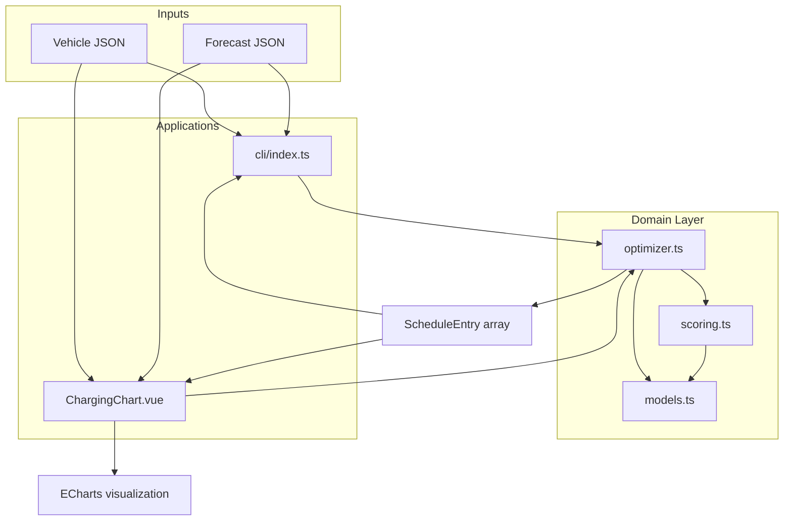
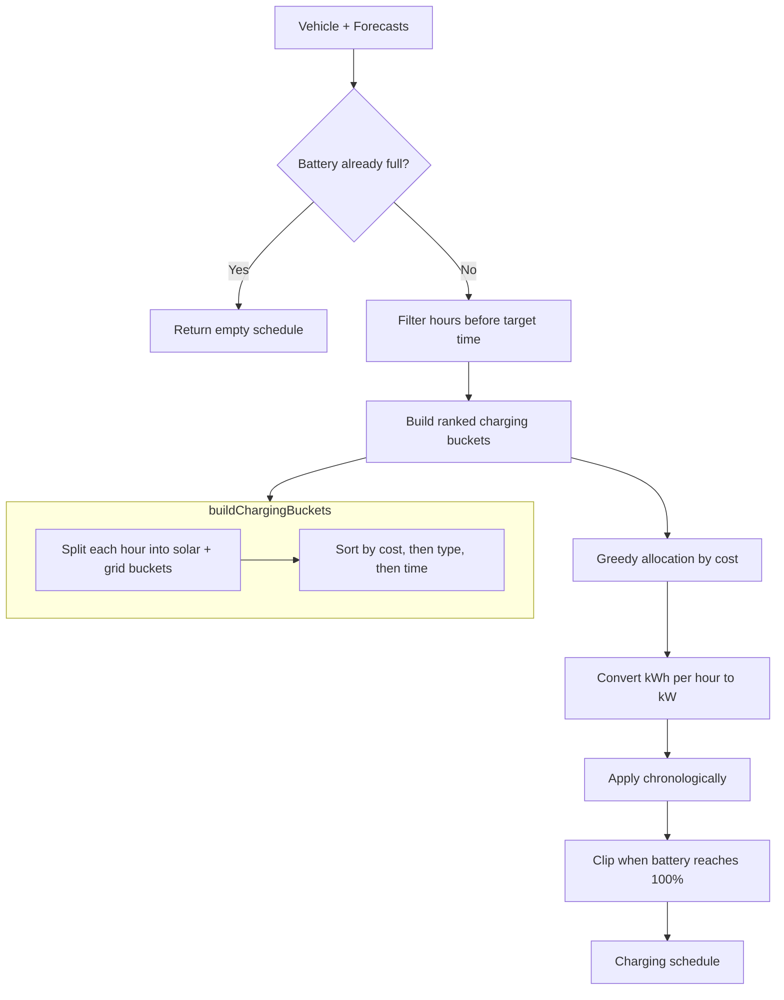
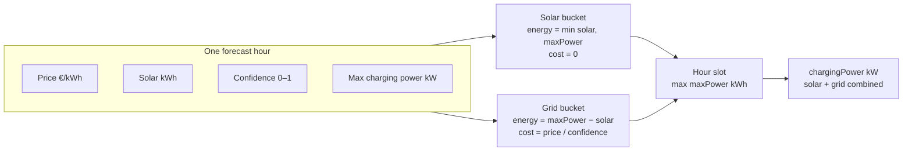
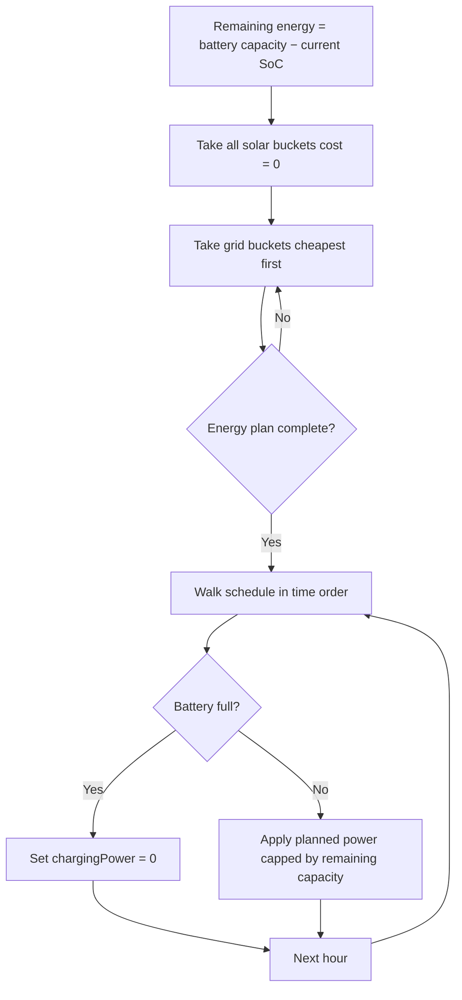

# EV Charging Schedule Optimizer

An algorithm and visualization tool that builds an optimal EV charging schedule from hourly forecasts of electricity price, solar production, and plug-in confidence.

Built as a take-home assignment for **Zählerfreunde** — reduce energy costs while maximizing local solar use, with uncertainty factored in.

## Approach

The optimizer uses a **split-slot greedy algorithm**. Each forecast hour is divided into two charging buckets:

| Bucket | Energy available | Cost |
|--------|------------------|------|
| **Solar** | `min(solar, maxChargingPower)` kWh | 0 (free local production) |
| **Grid** | remaining slot capacity | `price / confidence` per kWh |

All buckets across the planning horizon are ranked by cost. The algorithm greedily fills the cheapest buckets until the battery plan is satisfied, then applies the result chronologically so the battery never exceeds 100%.

This gives three behaviors in one model:

1. **Solar utilization** — partial solar hours charge at reduced power (e.g. 3 kW when only 3 kWh solar is available), not always at max power.
2. **Cost minimization** — grid energy is only bought from the cheapest reliable hours once free solar is exhausted.
3. **Reliability** — low plug-in confidence raises the effective grid cost, making uncertain cheap slots less attractive.

**Target SoC** is the minimum required by departure time. When affordable energy remains, charging continues up to **100% battery capacity**.

## Architecture

How the UI, CLI, and domain logic connect:



## Optimization pipeline

End-to-end flow inside `generateChargingSchedule`:



## Bucket model per hour

How a single forecast hour becomes chargeable energy:



Example for 3 kWh solar, 7.4 kW max, 0.28 €/kWh, 95% confidence:

- Solar bucket: **3 kWh at €0**
- Grid bucket: **4.4 kWh at €0.295/kWh**
- Possible outcomes: 3 kW solar-only, or 7.4 kW mixed, depending on what the greedy pass still needs.

## Bucket ranking and allocation

How the greedy pass decides what to charge:



## Key assumptions

- **Hourly slots** — each forecast entry represents one hour; charging power is constant within the slot.
- **Solar is free and local** — using forecasted solar costs nothing; unused solar in non-charging hours is not modeled (no feed-in tariff or curtailment).
- **Solar caps power, grid fills the rest** — within an hour, solar energy limits the free portion; any additional energy in that slot comes from the grid at the forecasted price.
- **Confidence adjusts grid cost only** — zero confidence excludes an hour entirely; solar buckets are also skipped when confidence is zero.
- **Fill to 100% when economical** — the optimizer plans energy up to full battery capacity, not just to target SoC, as long as affordable buckets exist before target time.
- **Perfect foresight** — prices, solar, and confidence are taken as given; no real-time re-optimization.

## Trade-offs

| Decision | Benefit | Cost |
|----------|---------|------|
| Greedy bucket filling | Simple, fast, easy to explain | Not globally optimal if hour coupling mattered |
| Split solar / grid buckets | Realistic partial solar charging | Two-pass planning (cost order, then time order) can discard late assignments if the battery fills early |
| `price / confidence` for grid | Handles uncertainty without complex probability models | Confidence is a scalar penalty, not a full stochastic model |
| No feed-in / export model | Keeps the objective function small | May under-use midday solar if the car is unplugged |
| Fill beyond target SoC | Captures cheap energy when available | Uses more energy than strictly required for departure |

## Project structure

```
src/
├── domain/
│   ├── models.ts       # Vehicle, ForecastHour, ScheduleEntry types
│   ├── scoring.ts      # Bucket building and cost ranking
│   └── optimizer.ts    # Schedule generation
├── cli/index.ts        # Command-line interface
├── components/
│   ├── ChargingChart.vue      # Interactive chart (Vue + ECharts)
│   └── CreateVehicleDialog.vue
├── data/               # Sample vehicles and forecast
└── tests/              # Vitest unit tests
examples/
├── sample-vehicle.json
└── sample-forecast.json
```

## How to run

Requires [Node.js](https://nodejs.org/) and [pnpm](https://pnpm.io/) (or npm).

```bash
# Install dependencies
pnpm install

# Run unit tests
pnpm test

# Start the web UI with chart visualization
pnpm dev
```

Open the URL shown in the terminal (typically `http://localhost:5173`). Select a vehicle, optionally upload a custom forecast JSON, and inspect the stacked chart of price, solar, confidence, charging power, and SoC.

### CLI

Generate a schedule from JSON files:

```bash
pnpm cli -- examples/sample-forecast.json examples/sample-vehicle.json
```

Example output:

```json
[
  { "hour": "2026-06-10T02:00:00Z", "chargingPower": 4.2 },
  { "hour": "2026-06-10T06:00:00Z", "chargingPower": 0.5 }
]
```

### Input format

**Vehicle** (`examples/sample-vehicle.json`):

| Field | Type | Description |
|-------|------|-------------|
| `batteryCapacity` | number | Max capacity in kWh |
| `currentSoc` | number | Starting SoC in % |
| `targetSoc` | number | Minimum required SoC by target time |
| `targetTime` | string | ISO timestamp deadline |
| `maxChargingPower` | number | Max charger power in kW |

**Forecast** (`examples/sample-forecast.json`) — array of hourly entries:

| Field | Type | Description |
|-------|------|-------------|
| `timestamp` | string | ISO timestamp for the hour |
| `price` | number | Electricity price in €/kWh |
| `solar` | number | Available solar energy in kWh |
| `confidence` | number | Plug-in probability from 0 to 1 |

## Tech stack

- **TypeScript** — domain logic and type safety
- **Vue 3 + Vuetify** — web UI
- **ECharts** — schedule visualization
- **Vitest** — unit tests
- **tsx** — CLI runner
