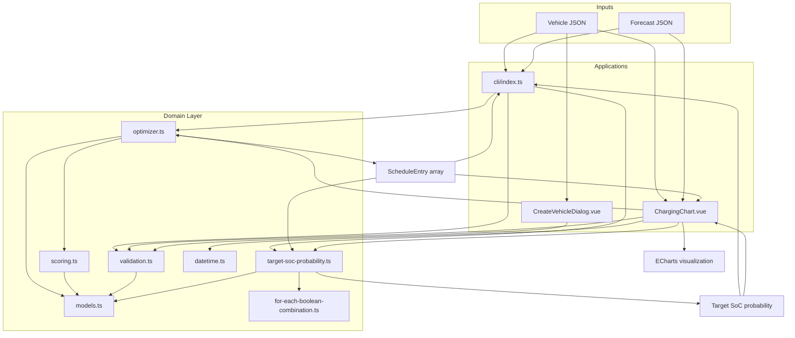
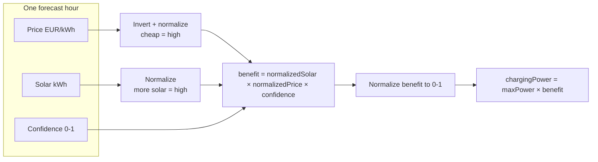

# EV Charging Schedule Optimizer

An algorithm and visualization tool that builds an EV charging schedule from hourly forecasts of electricity price, solar production, and plug-in confidence.

Goal: Reduce energy costs while maximizing local solar use, with uncertainty factored in.

## Approach

For each forecast hour in the planning window, the optimizer calculates a benefit score from 0 to 1 that indicates how favorable the hour is for charging.

1. **Solar** — more available solar raises the score.
2. **Price** — cheaper grid electricity raises the score.
3. **Confidence** — higher plug-in probability raises the score.

Calculate charginPower for each hour:

```
chargingPower = maxChargingPower × benefit
```

**Target time** is a hard deadline: only forecast hours whose start is on or before the target are considered. Sub-hour targets are supported.

**Target state of charge (SoC)** is validated on input and shown in the UI as a reference line. The optimizer itself plans energy up to the remaining battery capacity (toward 100%), not strictly to `targetSoC`.

**Probability to reach target SoC** — after the schedule is built, the program also calculates how likely it is that the vehicle will actually reach `targetSoC`. For each charging hour, the plug-in may succeed (delivering the planned energy) or fail (delivering nothing), according to that hour's confidence. The progam adds up the probability of every outcome where enough energy is delivered to reach the tartget SoC.

After having calculated the initial charging plan, the optimizer evaluates whether the sum of the hourly expected energies is at least equal to the required energy to reach the target SoC. If not, the optmizer multiplies the charging power of each hour with a booster value. The iteration to reach the target SoC is done at most 10 times.

## Project structure

```
src/
├── cli/index.ts                         # Command-line interface
├── components/
│   ├── ChargingChart.vue                # Visualization of the charging schedule
│   └── CreateVehicleDialog.vue          # Add vehicle form
├── data/                                # Sample vehicles and forecast
├── domain/
│   ├── datetime.ts                      # UTC ↔ local time helpers (UI)
│   ├── for-each-boolean-combination.ts  # Enumerates all 2^n probability outcomes
│   ├── models.ts                        # Vehicle, ForecastHour, ScheduleEntry types
│   ├── optimizer.ts                     # Schedule generation
│   ├── scoring.ts                       # Hour benefit scoring
│   ├── target-soc-probability.ts        # Target SoC reach probability
│   └── validation.ts                    # JSON parsing and input validation
└── tests/
    ├── datetime.test.ts
    ├── for-each-boolean-combination.test.ts
    ├── optimizer.test.ts
    ├── scoring.test.ts
    ├── target-soc-probability.test.ts
    └── validation.test.ts

examples/
├── sample-forecast.json
└── sample-vehicle.json
```

## Architecture

How the CLI, UI, and domain layer connect:




## Scoring model

How a single forecast hour becomes a benefit score:




## Iterate until target SoC is reached

1. For each hour, calculate the expected energy:
  ```ts
   expectedEnergy = chargingPower × plug-in confidence
  ```
2. Calculate the total expected energy by summing all hours.
3. If the total expected value is at least equal to the missing energy required to reach the target SoC, stop. Otherwise, increase the charging power for each hour by a factor of:

```
boostFactor = missingEnergy / totalExpectedEnergy
```

Repeat steps 1-3 until the target SoC is reached. Itearate at most 10 times.

## How to run the progam

Requires [Node.js](https://nodejs.org/) and [pnpm](https://pnpm.io/) (npm also works).

### CLI

Run the following command:

```bash
pnpm run cli -- examples/sample-forecast.json examples/sample-vehicle.json
```

You can also replace these example files with your own files.

The assignment requires a charging schedule array as output. The implementation can additionally calculate and display the probability of reaching the target SoC with option `--show-probability`.

Example output:

```json
[
  { "hour": "2026-06-10T06:00:00Z", "chargingPower": 0.8 },
  { "hour": "2026-06-10T12:00:00Z", "chargingPower": 4.69 }
]
```

Run the following command to additionally see the probability of reaching the target SoC:

```bash
pnpm run cli -- --show-probability examples/sample-forecast.json examples/sample-vehicle.json
```

```json
[
  { "hour": "2026-06-10T06:00:00Z", "chargingPower": 0.8 },
  { "hour": "2026-06-10T12:00:00Z", "chargingPower": 4.69 }
]
Probability to reach target SoC: 74%
```

### Web UI

Run the following comand:

```bash
pnpm dev
```

Open the URL shown in the terminal, usually [http://localhost:5173/](http://localhost:5173/).

You can either use the provided sample data or upload your own forecast data (as JSON) and create test vehicles. Note: this implementation only supports forecast up to 24 hours.

### Input format

**Vehicle** (`examples/sample-vehicle.json`):


| Field              | Type   | Description                                          |
| ------------------ | ------ | ---------------------------------------------------- |
| `batteryCapacity`  | number | Max capacity in kWh                                  |
| `currentSoc`       | number | Starting SoC in %                                    |
| `targetSoc`        | number | Minimum required SoC by target time                  |
| `targetTime`       | string | ISO 8601 deadline (minutes supported, stored in UTC) |
| `maxChargingPower` | number | Max charger power in kW                              |


**Forecast** (`examples/sample-forecast.json`) — array of hourly entries:


| Field        | Type   | Description                     |
| ------------ | ------ | ------------------------------- |
| `timestamp`  | string | ISO 8601 hour start             |
| `price`      | number | Electricity price in €/kWh      |
| `solar`      | number | Available solar energy in kWh   |
| `confidence` | number | Plug-in probability from 0 to 1 |


Both files are validated on load: required fields, numeric ranges, chronological unique timestamps, and target time within the forecast window.

## How the program is tested

All TypeScript files are covered by unit tests.

## How to run the tests

```bash
pnpm run test
```

```bash
pnpm test:coverage
```


## Key assumptions

- **Hourly slots** — for the duration of each hour, the electricity price, solar procution and plug-in confidence are constant.
- **Sub-hour target times** — the hour bucket whichs starts on or before the target is included (e.g., if the target time is at 12:20, the maximum charging power is 1/3 of the maximum charging power of that hour).

## Trade-offs


| Decision                                                     | Benefit                                 | Cost                                                                                                                        |
| ------------------------------------------------------------ | --------------------------------------- | --------------------------------------------------------------------------------------------------------------------------- |
| Benefit-weighted proportional power                          | Simple, easy to understand              | Simplistic algorithm. Doesn't cover all edge-cases, e.g., if target time is very close to the first forecast hour.          |
| Combined solar × price x confidence                          | Balances the three goals in one ranking | Zero solar generation results in a score of zero, preventing charging even though the price would be low.                   |
| All-or-nothing iteration when additional energy is allocated | Simplicity                              | Doesn't allocate any additional energy if the sum of the energy of all hours exceeds the remaining capacity of the battery. |


## Limitations

- Constraint of forecast up to 24 hours
- The algorithm doesn't allow negative electricity prices as inputs. Negative electricity prices are possible at least in Finland.
- Price, solar and plug-in confidence coefficients are equal. These could be weighed with coefficients.
- O(2^n) probability calculation. Works still with a 24 hour dataset but would take too long with a large number of forecast hours.
- The target SoC cannot be reached through boosting. The highest-benefit hours are already charging at the vehicle's maximum power, so boosting has no effect on those slots. Although boosting increases charging power during lower-benefit hours and therefore deliver some additional energy, the gain is insufficient to reach the target SoC. As a solution, `boostRatio` could be multiplied by a coefficient (>1) to compensate for the missing energy and distribute a larger share of charging power to the remaining available slots. Finding an appropriate value for this coefficient would require substantial investigation.
- If all the hours have 0 solar energy (which is not impossible), then no charging at all would occur. This may be the worst limitation  of this implementation. 

## Tech stack

- **TypeScript** — domain logic
- **Vue 3 + Vuetify** — web UI
- **ECharts** — schedule visualization
- **Vitest** — unit tests

